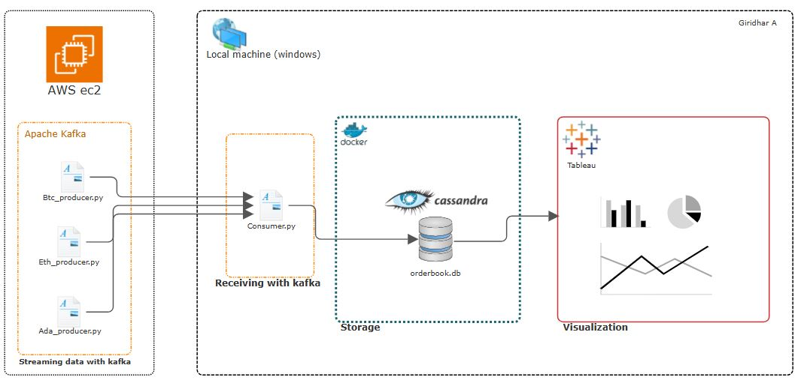
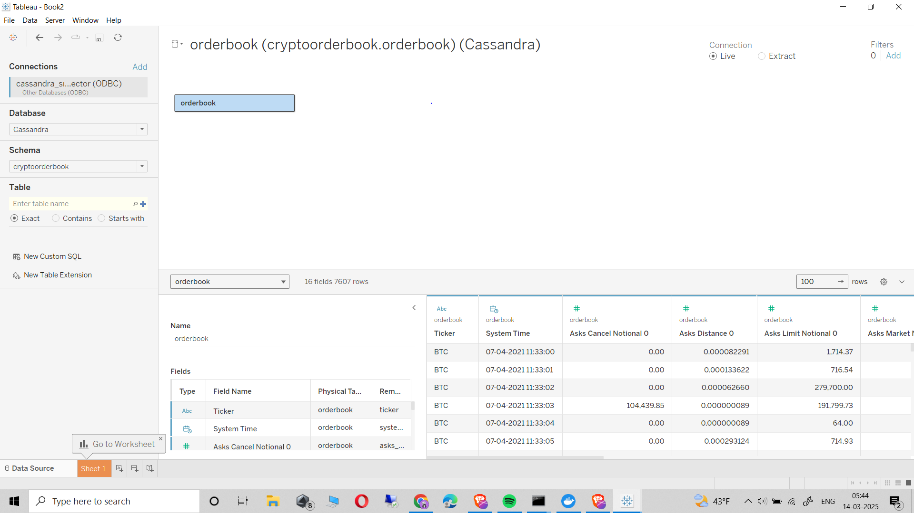
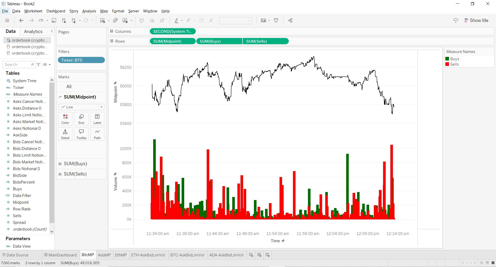

# RealTime_OrderBook_Data_Pipeline
### Architecture 



### Hardware and Software Used

#### Hardware:
- **AWS EC2 instance**: `t2.micro` (1 vCPU, 1 GiB RAM)
- **Windows 10-Local machine**

#### Software:
- **Ubuntu 22.04.5 LTS (GNU/Linux 6.8.0-1024-aws x86_64)**
- **Python 3.10.12**
- **Kafka 3.8.0**
- **Docker version 25.0.3**
- **Cassandra 5.0.2**
- **Tableau 2024.3.2**

Amazon Ec2 instance: t2.micro (1 vCPU, 1 GiB RAM)

### Dataset
To mimic an api we use 1 sec time frame dataset from [kaggle](https://www.kaggle.com/datasets/martinsn/high-frequency-crypto-limit-order-book-data).
This dataset contains limit order book data for Bitcoin (BTC), Ethereum (ETH), and Cardano (ADA) over a period of approximately 12 days. The data was collected from Coinbase's websocket and processed into snapshots at 1-second, 1-minute, and 5-minute intervals. This dataset provides valuable insights into market microstructure, liquidity, and order flow dynamics for cryptocurrency trading analysis.
Link to dataset: (https://www.kaggle.com/datasets/martinsn/high-frequency-crypto-limit-order-book-data).

The [dataset](Data) has been cleaned up to make sure we only use the useful and relevant parameters.   

### Producers
We will be running scripts [Btc_producer.py](Code/Btc_producer.py), [Eth_producer.py](Code/Eth_producer.py) and [Ada_producer.py](Code/Ada_producer.py) on our ec2 instance which will contain kafka streaming services which will simulate that of an api.

Before we run the producer files, we need to first initialize apache kafka and zookeeper. You can refer this [repo](https://github.com/giridhar1103/Kafka_Demo-Setup) to learn how to install Apache Kafka on ec2 instances like t2.micro (or any other instance that has low cpu). 

If you have already set up, then just run:

```bash
bin/zookeeper-server-start.sh config/zookeeper.properties
```
```bash
bin/kafka-server-start.sh config/server.properties
```

Remember that we need to run these both commands on different ec2 instance sessions.

Now let's run the producer files:
```bash
python3 <your_producer_file>.py
```

The Python scripts read historical order book data from [CSV files](Data) and streams it to an Apache Kafka topic (orderbook_stream). It uses the KafkaProducer from the kafka-python library to send each row of the CSV as a JSON message to the specified Kafka broker, with a 1-second interval between messages—simulating real-time data streaming.

### Consumer
The [consumer script](Code/consumer.py) consumes real-time order book data from a Kafka topic (orderbook_stream) and inserts it into an Apache Cassandra database (cryptoorderbook.orderbook). It connects to a Kafka broker, deserializes incoming JSON messages, and stores each message as a new row in Cassandra. The script is part of a data pipeline that captures and persists high-frequency trading data for further processing or analysis, with error handling included for both Kafka and Cassandra connections.

If there was an issue or if you want to clear your database to restart the process, you can use the shortcut python file to TRUNCATE the data. [clear_orderbook.py](Code/clear_orderbook.py)

### Running cassandra on a local machine(windows)
To run a cassandra database on our windows local machine, we can use a docker container which has cassandra installed in it. Open command prompt or powershell and enter:

```bash
docker run --name cassandra -d -p 9042:9042 cassandra
```
This code pulls cassandra from docker hub and creates a cassandra image where you can store data in a docker container.

Check cassandra's official website (https://cassandra.apache.org/) to install it according to your needs.

Now we access the bash of this cassandra container from our cmd/terminal by running the code:
```bash
docker exec -it <your_cass_container_name> bash
```
This will let you access the bash of the cassandra container. From here we can run commands to open cqlsh:

```bash
cqlsh
```

### Connect cassandra to tableau
To connect our cassandra database to tableau, we use a OBD Connector. Go to https://insightsoftware.com/drivers/cassandra-odbc-jdbc/ and download the trial version, follow the instructions to set it up and
then configure user DSN where we will enter the host name as "localhost", port as "9042", default keyspace name as your desired keyspace (here it is cryptoorderbook).

Next, go to tableau and create a new book, then go to new data souce. Now you can add your simba OBDC here and select your database name, schema and table name. You will see the data get updated on the right side.




### Visualization:
We will be visualizing the data that is being fed into our cassandra database in real time using a tableau dashboard.

First we create a simple sheet with one chart visualizing the different parameters of btc's openbook data and we repeat the same for the other two crypto currencies. 



We can see from the [kaggle website](https://www.kaggle.com/datasets/martinsn/high-frequency-crypto-limit-order-book-data/data):

midpoint = the midpoint between the best bid and the best ask  
spread = the difference between the best bid and the best ask  
bids_distance_x = the distance of bid level x from the midprice in %  
asks_distance_x = the distance of ask level x from the midprice in %  
bids_market_notional_x = volume of market orders at bid level x  
bids_limit_notional_x = volume of limit orders at bid level x  
bids_cancel_notional_x = volume of canceled orders at bid level x  
asks_market_notional_x = volume of market orders at ask level x  
asks_limit_notional_x = volume of limit orders at ask level x  
asks_cancel_notional_x = volume of canceled orders at ask level x  

We plot the midpoint of each second against time along with the volume of buys(in green) and volume of sells(in red) for each second. For our second metric, we plot the volume of limit order of asks and volume of limit order of bids to see which is being dominated; The selling side or the buying side. 

Final dashboard:
[finalDashboard](images/Dashboard.png)
